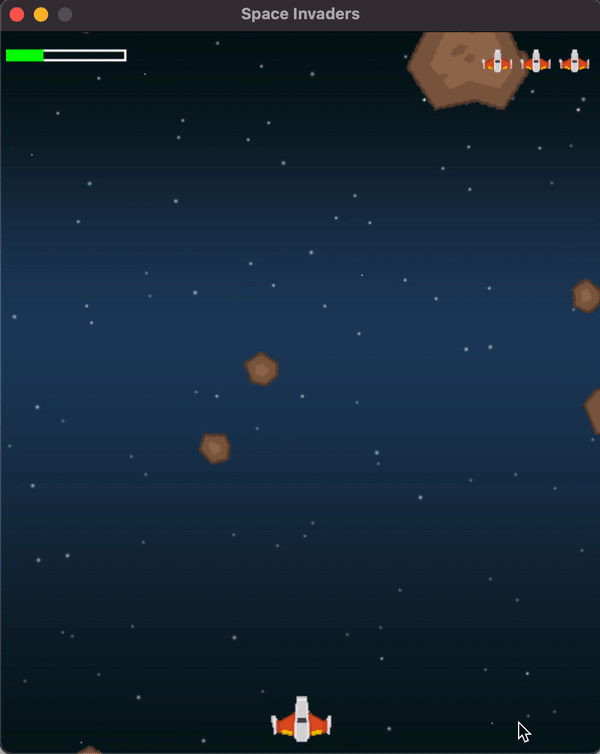
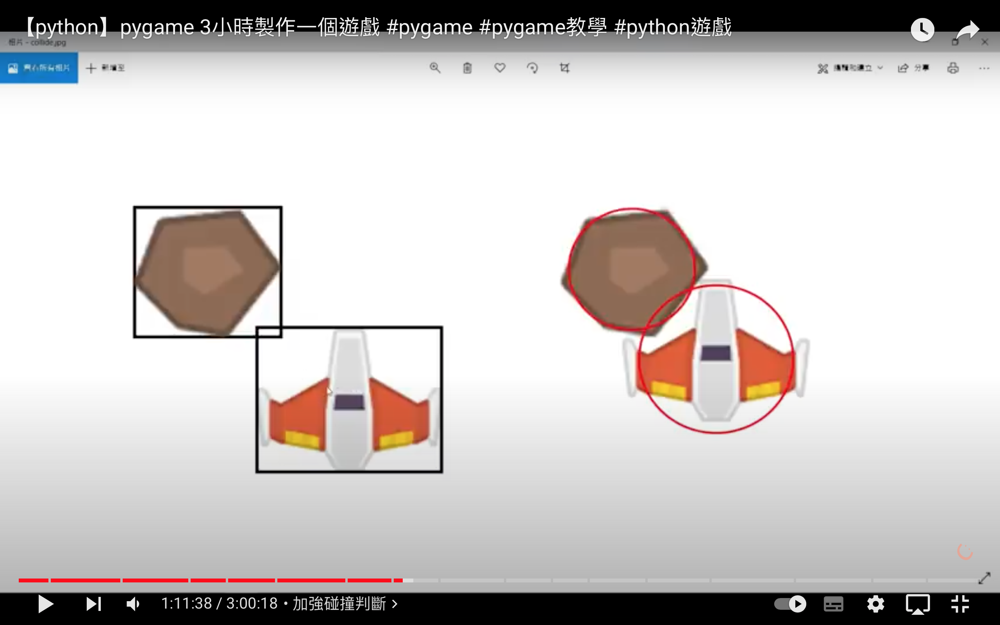
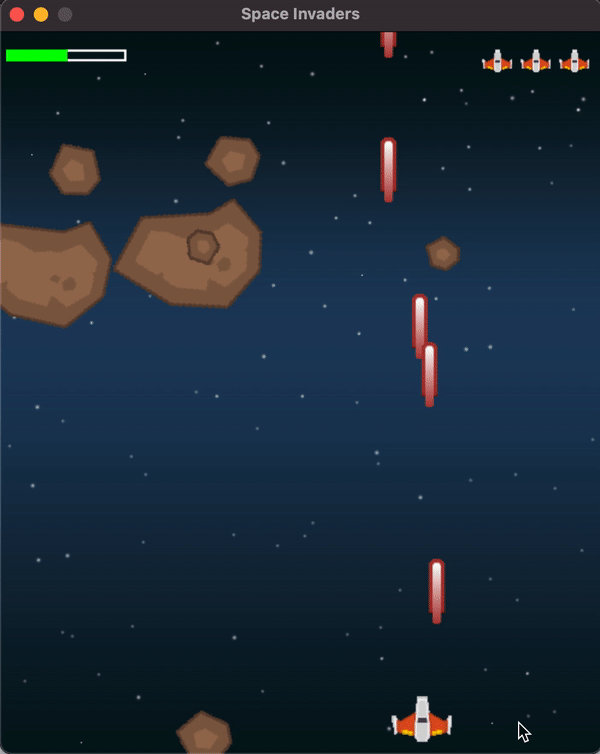

# Space Invaders

從小就很喜歡打電動，,也曾經幻想著要是有機會可以製作出自己的遊戲就好了。  
在學會了程式以後，拜強大的第三方套件與網路資源所賜，終於有機會可以圓夢了！

雖然是跟著教學影片一個步驟一個步驟刻出來的，但每完成一個小功能，還是非常有成就感！  

從一開始了解遊戲的主架構為下面三個部分組成的，並由一個主要的迴圈不停的在重複這三個步驟：
- 輸入處理
- 更新遊戲
- 呈現更新

到中間代入碰撞的概念。在以前第一次聽到遊戲裡的碰撞，我認為這是一開始最難以處理的部分。因為必須把遊戲裡的不規則物件模擬成矩形或圓形、再根據四邊或圓周來計算兩物體是否碰撞。  
但 pygame 裡很有現成的函式幫忙處理好了，對初學者十分友善。

一直到最後完成一個完整的遊戲，還可以吃能力加子彈，真的太有成就感啦！俗話說的好「模仿是學習的開始」。下一步就是試著改改看程式碼、換換圖片甚至試著自己加入新的能力。  
是一次非常愉快的練習！

# Reference
教學影片：[GrandmaCan](https://www.youtube.com/watch?v=61eX0bFAsYs)